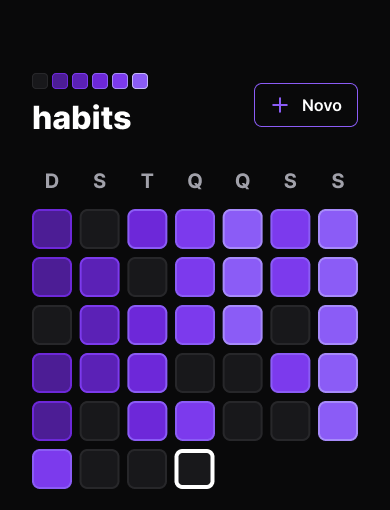

## A mobile app for the user control and manage his daily activities and tasks. Developed in the [Rocketseat](https://www.rocketseat.com.br/) NLW Setup.

### 📱 Technologies

- [React Native](https://reactnative.dev/)
- [TypeScript](https://www.typescriptlang.org/)
- [Expo](https://expo.dev/)
- [React Native Reanimated](https://docs.swmansion.com/react-native-reanimated/)
- [React Navigation](https://reactnavigation.org/)
- [Axios](https://axios-http.com/ptbr/docs/intro)
- [NativeWind](https://www.nativewind.dev/)

### 📥 Installation

```bash
git@github.com:arthurlbo/habits-app.git
cd habits-app
```

### 🚀 Run

```bash
npm install
npx expo start
```

## Made with 💜 by Arthur
