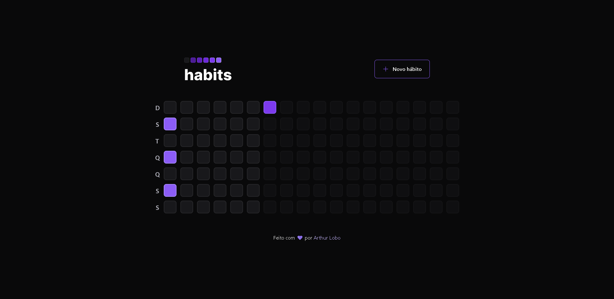

### Hi there! 👋

> A habit tracker app for the user register new habits, manage his daily activities and tasks.
>
> The objective of this project was to improve my UX and UI skills and also the improvement of tools for frontend development such as React, Typescript, Tailwind, among others .
>
> [Prototype in Figma](https://www.figma.com/file/Cby00zt7Uwe8pBx0JfrEj8/Habits-(i)-(Community)?type=design)

## What is inside?

- [ReactJS](https://reactjs.org)
- [TypeScript](https://www.typescriptlang.org)
- [TailwindCSS](https://tailwindcss.com/)
- [Radix UI](https://www.radix-ui.com/)
- [Phospor icons](https://phosphoricons.com/)
- [Axios](https://axios-http.com/ptbr/docs/intro)
- [Eslint](https://eslint.org)
- [Prettier](https://prettier.io)
- [Vite](https://vitejs.dev/)

## Getting Started

### Install dependencies:

```bash
pnpm install
```

or

```bash
yarn
```

or

```bash
npm install
```

### Run development server

```bash
pnpm dev
```

or

```bash
yarn dev
```

or

```bash
npm run dev
```

Open [http://localhost:3000](http://localhost:3000) with your browser to see the result.

## Structure

```
└── src
    ├── assets
    ├── components
    ├── lib
    ├── styles
    ├── utils
```

| Folder         | Description                                          |
| ----------     | -------------------------------------------          |
| **assets**     | Images and static files for application              |
| **components** | Pages components                                     |
| **lib**        | Configuration of libraries used in the project       |
| **styles**     | Default style for application                        |
| **utils**      | Auxiliary and reusable functions                     |

## Commands

- `dev`: run development server
- `build`: creates the production build version
- `lint`: runs the linter in all components and pages


## 📱 Mobile version

[Habits App](https://github.com/arthurlbo/habits/tree/main/mobile)

## 🚀 Api

[Habits Api](https://github.com/arthurlbo/habits/tree/main/server)

<p align="center">Made with 🤍 by Arthur</p>
